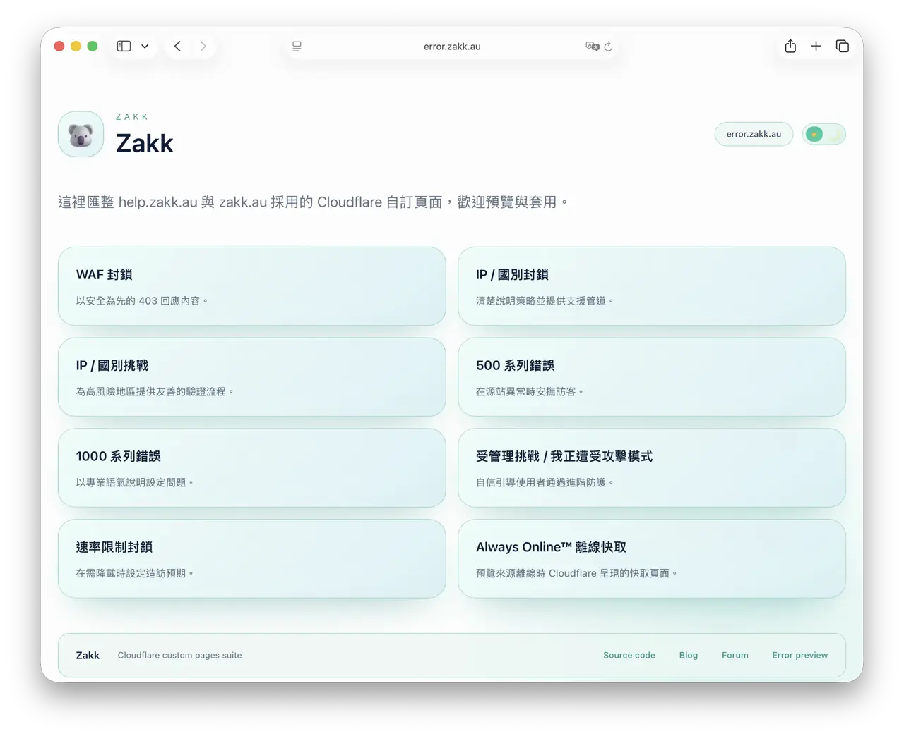
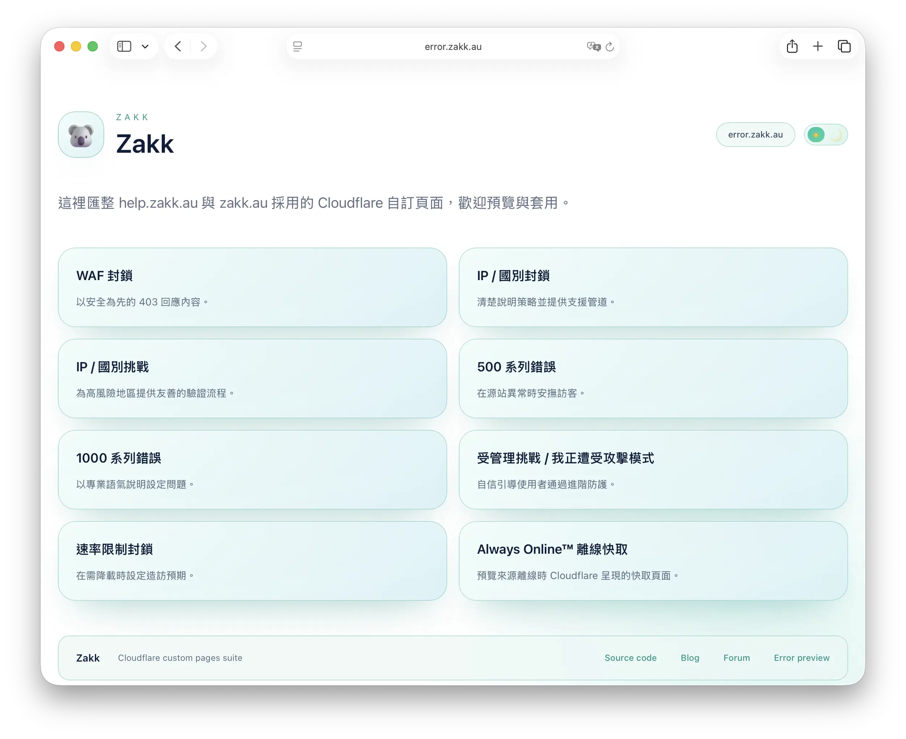
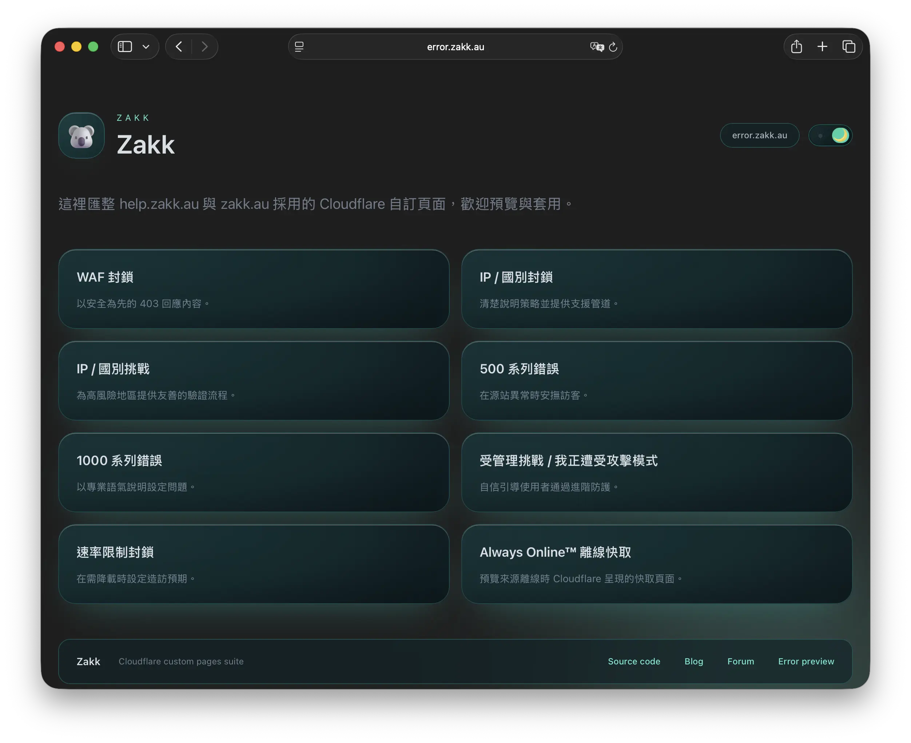
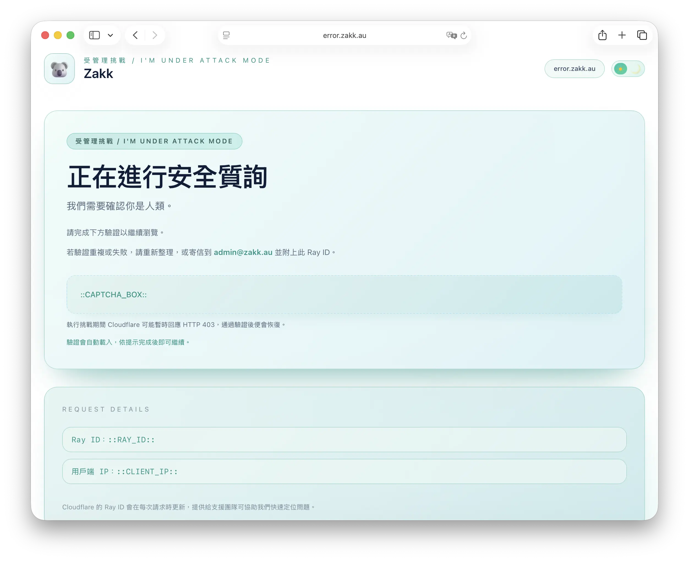
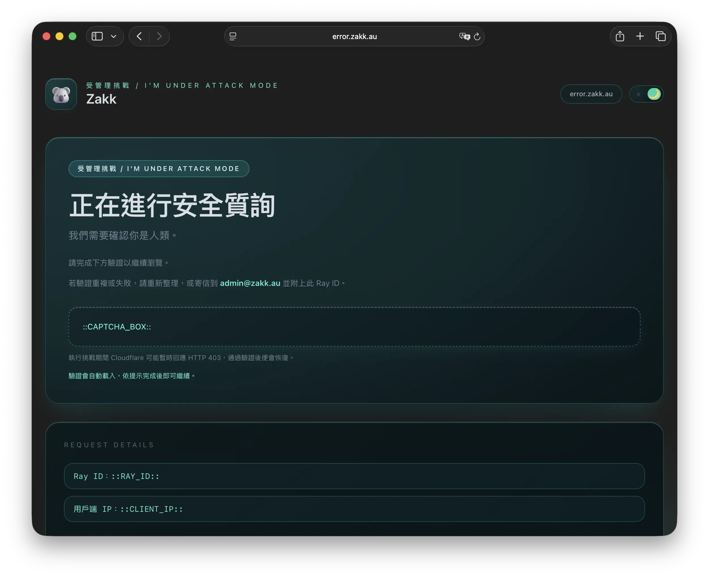

## Why build a dedicated error.zakk.au?

When Cloudflare shows a default error page, the experience feels disconnected from the rest of the brand. I wanted a lightweight replacement that:

- Auto-detects dark/light preference and lets visitors switch themes manually
- Detects language preferences automatically (English, Traditional Chinese, Simplified Chinese)
- Surfaces contextual help, including the **Ray ID** and a pre-filled support email link
- Runs entirely on Cloudflare Pages, so updates ship with a single git push

That led to the [`Zakkaus/cf-pages`](https://github.com/Zakkaus/cf-pages) project and the live deployment at [error.zakk.au](https://error.zakk.au/).

## Interface highlights

  <figure class="space-y-3">
    
    <figcaption class="text-sm text-neutral-500 dark:text-neutral-400">The light theme keeps typography airy and pairs the language/menu controls side by side for quick scanning.</figcaption>
  </figure>
  <figure class="space-y-3">
    
    <figcaption class="text-sm text-neutral-500 dark:text-neutral-400">Dark mode leans on the brand blue accents while maintaining contrast ratios that pass WCAG.</figcaption>
  </figure>
  <figure class="space-y-3">
    
    <figcaption class="text-sm text-neutral-500 dark:text-neutral-400">The challenge template walks visitors through the verification flow and keeps context links one tap away.</figcaption>
  </figure>
  <figure class="space-y-3">
    
    <figcaption class="text-sm text-neutral-500 dark:text-neutral-400">Dark mode preserves hierarchy and CTA prominence so the brand story and accessibility stay aligned.</figcaption>
  </figure>

## What ships with the repository?

The repo bundles the full catalogue of Cloudflare error templates, each rewritten with a clean card layout and Tailwind CSS styling:

| Template | Scenario |
| --- | --- |
| `cf-1000.html` | Configuration errors across Cloudflare edge services |
| `cf-500.html` | Generic 5xx origin failures |
| `cf-waf-block.html` | Web Application Firewall blocks |
| `cf-ip-block.html` | IP or country blocks |
| `cf-ip-challenge.html` & `cf-attack.html` | Managed challenge / "I'm Under Attack" flows |
| `cf-rate-limit.html` | 429 rate limiting responses |
| `offline.html` | Always Online™ fallback |

Every page injects brand visuals (logo, koala 3D hero), the current Ray ID, and a single CTA leading to self-serve troubleshooting. The card layout keeps critical guidance above the fold no matter the viewport.

## Multilingual copy and automatic detection

All strings live in `lang.js`. The helper picks the correct locale by:

1. Reading `navigator.language`
2. Matching it against `en`, `zh-Hant`, or `zh-Hans`
3. Falling back gracefully if a language is missing

Once the page loads, visitors can still toggle languages manually—the state sticks thanks to `localStorage`.

## Design system & theming

- **Tailwind CSS pipeline**: Author classes in `input.css`, build a minified `output.css` via `npm run build` (or `pnpm run build`) with PurgeCSS trimming unused utilities.
- **Day/night parity**: Screenshots (`assets/screenshots/*.webp`) capture both light and dark variants to ensure contrast passes WCAG.
- **Shared components**: Buttons, alerts, and layout primitives map closely to the Blowfish theme I run on this blog, so switching contexts feels seamless.
- **Brand system carryover**: Illustration tone, gradient tokens, and CTA colors stay in sync with the rest of the zakk.au ecosystem.

## Deployment on Cloudflare Pages

1. Connect the repository to Pages and keep the build command as `npm run build`.
2. Use the `None` framework preset; Pages will compile Tailwind before publishing.
3. Serve the root directory—each HTML template sits at the project root for direct mapping inside the Cloudflare dashboard.
4. Map the Pages project to **Custom Error Pages → error.zakk.au** and optionally reuse the set for help portals.

Because Pages caches builds per commit, I can preview updates safely before flipping the toggle in the Cloudflare dashboard.

## Troubleshooting flow with Ray IDs

At the bottom of every template is a "Need help?" block that:

- Shows the Ray ID that triggered the error in real time
- Links visitors to a pre-filled email (`support@zakk.au`) with the Ray ID, timestamp, and the client's IP (once Cloudflare injects it)
- Offers a secondary link to the status page when the issue is clearly on my side

This dramatically reduces back-and-forth; I receive every diagnostic detail in the first message.

## Try it yourself

- Explore the code & screenshots: [`Zakkaus/cf-pages` on GitHub](https://github.com/Zakkaus/cf-pages)
- Trigger a sample page (e.g. the offline notice) via [error.zakk.au/offline.html](https://error.zakk.au/offline.html)
- Want to skin it for your brand? Swap the assets in the repo, adjust copy in `lang.js`, and redeploy to your own Pages project.

Building this catalogue turned "random Cloudflare error" moments into an opportunity to reassure visitors, stay multilingual, and capture context when it matters most.
