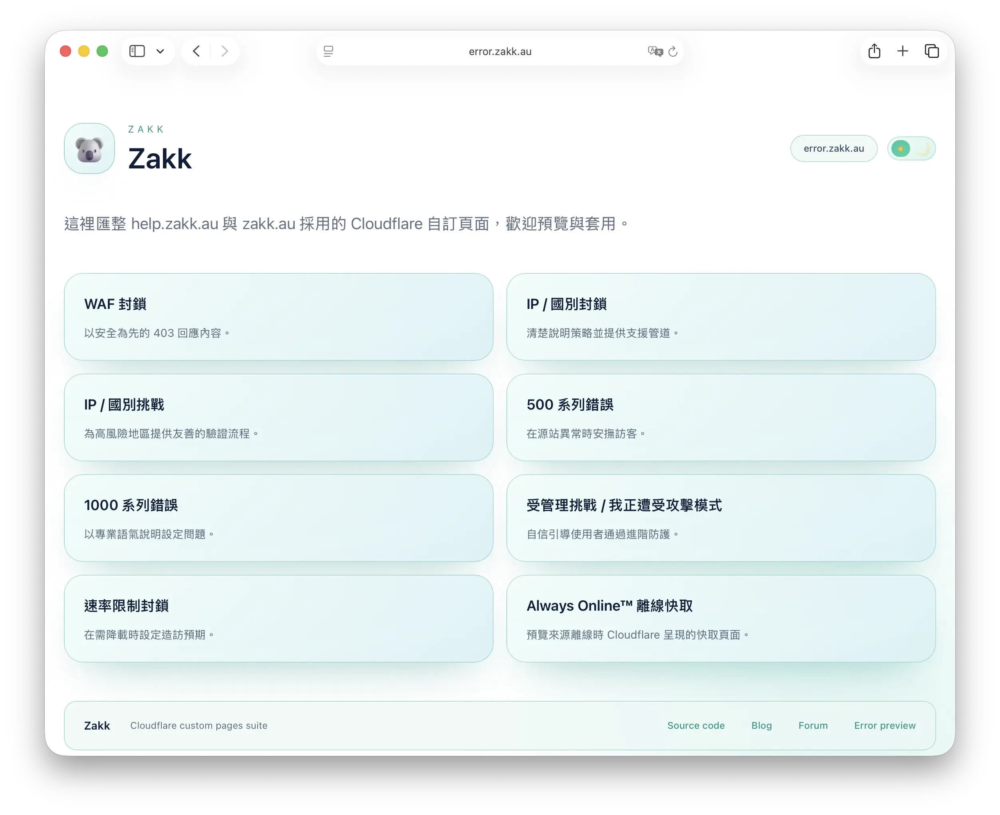
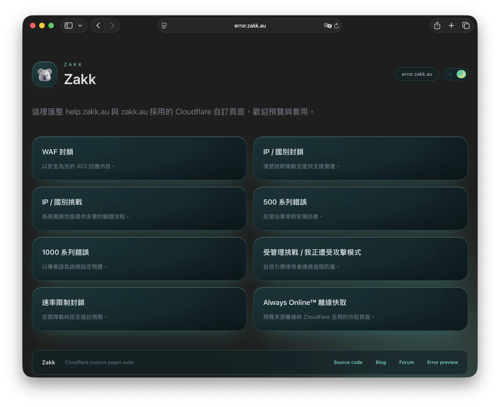
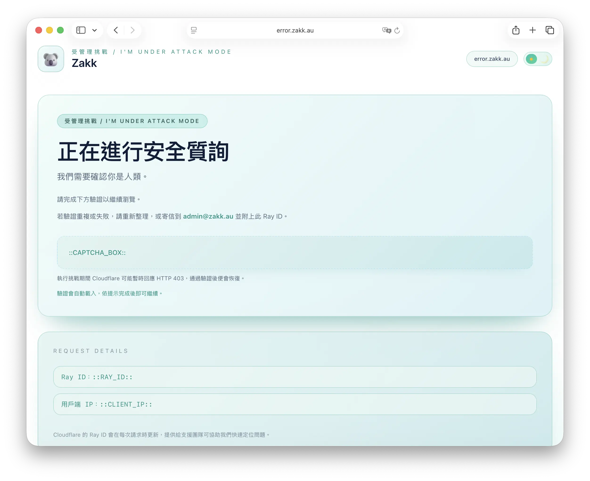
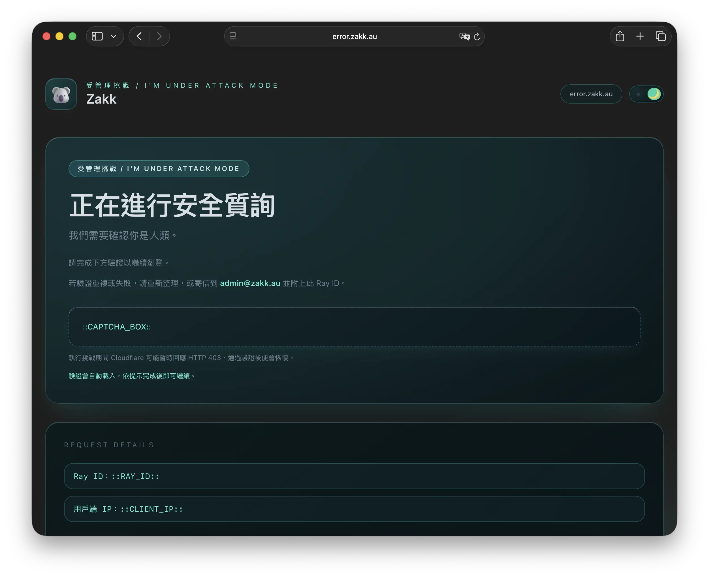

## Why a dedicated error.zakk.au?

Cloudflare's stock error pages feel detached from the rest of the site. I wanted a lightweight replacement that:

- Auto-detects light/dark preference and lets visitors switch manually
- Detects locale automatically (English, Traditional Chinese, Simplified Chinese)
- Surfaces the **Ray ID** and a pre-filled support email link
- Lives on Cloudflare Pages so updates ship with a single `git push`

The result is [`Zakkaus/cf-pages`](https://github.com/Zakkaus/cf-pages), deployed at [error.zakk.au](https://error.zakk.au/).

## Screens

|  |  |
| --- | --- |
| Light mode: language and theme switches sit side by side, Ray ID front and centre. | Dark mode keeps the same hierarchy with brand-blue accents and AA contrast. |

|  |  |
| --- | --- |
| The challenge template walks visitors through verification with contextual help. | Dark counterpart keeps CTAs and guidance visible at night. |

## What ships in the repo

The repo bundles a template for each common Cloudflare scenario, rewritten with a clean card layout and Tailwind CSS:

| Template | Scenario |
| --- | --- |
| `cf-1000.html` | Configuration errors across Cloudflare edge services |
| `cf-500.html` | Generic 5xx origin failures |
| `cf-waf-block.html` | Web Application Firewall blocks |
| `cf-ip-block.html` | IP or country blocks |
| `cf-ip-challenge.html` & `cf-attack.html` | Managed challenge / "I'm Under Attack" flows |
| `cf-rate-limit.html` | 429 rate limiting |
| `offline.html` | Always Online fallback |

Each page injects brand visuals (logo, koala hero), the current Ray ID, and a single CTA to self-serve troubleshooting. The card layout keeps the key guidance above the fold on any viewport.

## Locale detection

All strings live in `lang.js`. The helper:

1. Reads `navigator.language`
2. Matches it against `en`, `zh-Hant`, or `zh-Hans`
3. Falls back to English when no match exists

Visitors can override the choice manually; the preference is persisted in `localStorage`.

## Styling

- **Tailwind CSS:** classes are authored in `input.css`, then `npm run build` (or `pnpm run build`) outputs a minified `output.css` with PurgeCSS removing unused utilities.
- **Light/dark parity:** screenshots in `assets/screenshots/*.webp` cover both variants so contrast can be verified against WCAG.
- **Shared components:** buttons, alerts, and layout primitives match the Blowfish theme I use on the blog so the visual language stays consistent.

## Deploy on Cloudflare Pages

1. Connect the repo to Pages with build command `npm run build`.
2. Use the `None` framework preset; Pages will compile Tailwind before publishing.
3. Serve the repo root — each HTML template sits at the project root for direct mapping in the Cloudflare dashboard.
4. Point **Custom Error Pages → error.zakk.au** at the Pages project. The same set can be reused for help portals.

Pages caches one build per commit, so previews can be verified before flipping the dashboard toggle.

## Ray ID handoff

Every template ends with a "Need help?" block that:

- Shows the Ray ID that triggered the error
- Links to a pre-filled email to `support@zakk.au` carrying the Ray ID, timestamp, and visitor IP (once Cloudflare injects it)
- Links to a status page when the issue is clearly on my side

The first support message arrives with enough context to skip the usual round-trip.

## Try it

- Source and screenshots: [`Zakkaus/cf-pages` on GitHub](https://github.com/Zakkaus/cf-pages)
- A sample page (offline notice): [error.zakk.au/offline.html](https://error.zakk.au/offline.html)
- To rebrand: swap the assets, edit `lang.js`, redeploy to your own Pages project.
