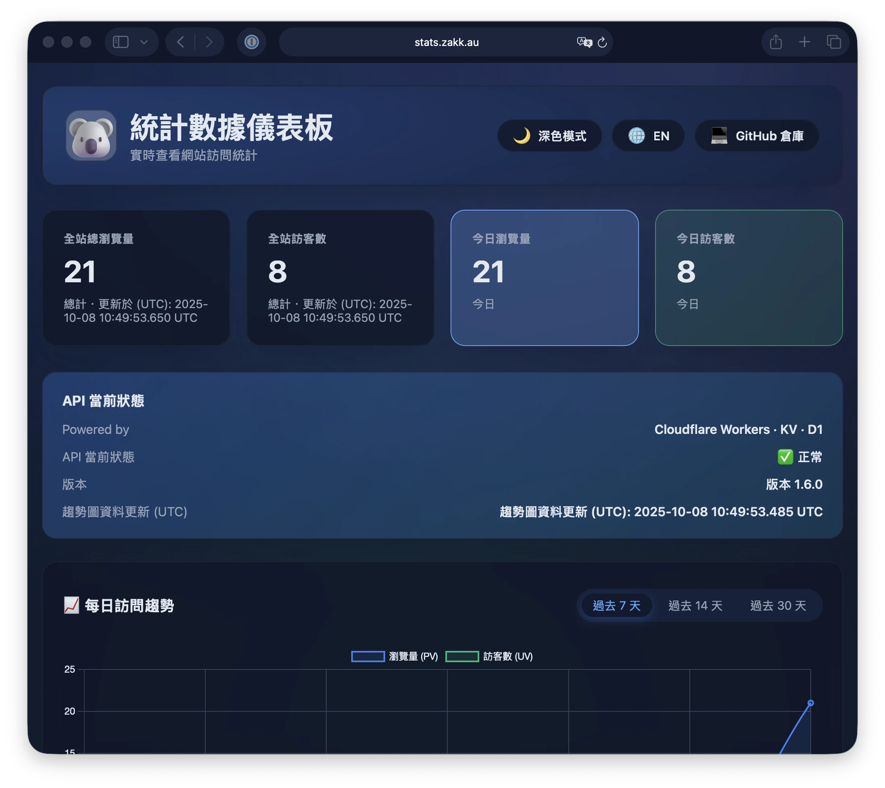

Want real-time website analytics without Google Analytics? **Cloudflare Stats Worker** is a privacy-first analytics solution that runs entirely on Cloudflare's edge network.

Check out the live demo: **[stats.zakk.au](https://stats.zakk.au/)**



## Why Cloudflare Stats Worker?

- **Privacy-First**: No cookies, IP addresses are SHA-256 hashed and truncated
- **Zero Cost**: Runs on Cloudflare's free tier for most personal sites
- **Edge Performance**: Built on Cloudflare Workers + KV for global low-latency access
- **Multi-Language Support**: Automatically normalizes paths across different language versions
- **Complete Solution**: API endpoints + standalone dashboard in a single Worker

## Key Features

### Real-Time Analytics
- Today's PV/UV counters with live updates
- Historical trends for 7/14/30 days
- Top 10 most popular pages ranking

### Beautiful Dashboard
- Glass-morphism design with dark/light theme support
- Responsive layout for mobile and desktop
- Multi-language UI (English/Chinese)
- Accessible at your custom domain (e.g., stats.example.com)

### Developer-Friendly API
- RESTful API endpoints for custom integrations
- Batch operations for efficient data queries
- Health check endpoint for monitoring

## Quick Deployment

> Requirements: Node.js ≥ 18, `wrangler` CLI ≥ 3.0.

1. **Clone and enter the repository**
   ```bash
   git clone https://github.com/Zakkaus/cloudflare-stats-worker.git
   cd cloudflare-stats-worker
   ```

2. **Install Wrangler and log in**
   ```bash
   npm install -g wrangler
   wrangler login
   ```

3. **Create the KV namespace**
   ```bash
   wrangler kv namespace create PAGE_STATS
   wrangler kv namespace create PAGE_STATS --preview
   ```
   Then paste the IDs into `wrangler.toml`.

4. **(Optional) Enable D1 for trends and top pages**
   ```bash
   wrangler d1 create cloudflare-stats-top
   wrangler d1 execute cloudflare-stats-top --file=schema.sql --remote
   ```
   Uncomment the `d1_databases` section in `wrangler.toml` and set the generated IDs.

5. **Deploy 🎉**
   ```bash
   wrangler deploy
   ```

## Step 7: Access Your Analytics Dashboard

After deployment completes, visit your dashboard directly:

```
https://stats.example.com/
```

You'll see a beautiful analytics interface just like [stats.zakk.au](https://stats.zakk.au/) with:

- **Real-time metrics**: Today's PV/UV cards with instant updates
- **API health status**: Visual indicator showing system status
- **Trend charts**: Interactive graphs for 7/14/30-day periods
- **Top pages**: Ranked list of your most popular content
- **Theme toggle**: Switch between dark and light modes
- **Language selector**: English and Chinese interface options

The dashboard is completely standalone - no embedding needed, just share the URL!

## Pricing: Free Tier vs Paid Plans

### Workers

| Plan | Price | Included Requests | CPU Time | Overage Pricing |
|------|-------|-------------------|----------|-----------------|
| **Free** | $0 | 100k requests/day | 10ms/request | N/A (hard limit) |
| **Paid** | **$5/month** | 10M requests/month | 50ms/request | $0.50 per additional 1M requests |

### KV (Key-Value Storage)

| Plan | Price | Reads | Writes/Deletes/Lists | Storage | Overage Pricing |
|------|-------|-------|---------------------|---------|-----------------|
| **Free** | $0 | 100k/day | 1k/day each | 1 GB | N/A (hard limit) |
| **Paid** | **Included in Workers Paid ($5/mo)** | 10M/month | 1M/month each | 1 GB | • Reads: $0.50 per 10M<br>• Writes: $5 per 1M<br>• Storage: $0.50 per GB/month |

### D1 (Serverless SQL Database)

| Plan | Price | Rows Read | Rows Written | Storage | Overage Pricing |
|------|-------|-----------|--------------|---------|-----------------|
| **Free** | $0 | 5M rows/day | 100k rows/day | 500 MB | N/A (hard limit) |
| **Paid** | **$5/month** | 25B rows/month | 50M rows/month | 5 GB | • Reads: $0.001 per 1M rows<br>• Writes: $1 per 1M rows<br>• Storage: $0.75 per GB/month |

### Pay-As-You-Go Option

Even without subscribing to paid plans, you can **enable pay-as-you-go billing** to avoid hard limits:
- Workers: $0.50 per 1M requests beyond free tier
- KV: Individual operation pricing as listed above
- D1: Individual operation pricing as listed above

### Recommendation for This Project

- **Small personal blog (< 10k visitors/day)**: Free tier is perfect ✅
- **Medium blog (10k-50k visitors/day)**: Workers Paid ($5/mo) recommended
- **High-traffic site (> 50k visitors/day)**: Workers Paid + pay-as-you-go for KV/D1

> **Note**: D1 is optional. If you only need real-time PV/UV counting, KV alone is sufficient and the dashboard still works (minus Top 10 trends).

## API Endpoints

Once deployed, you can access these endpoints:

```bash
# Health check
curl https://stats.example.com/health

# Page view count
curl "https://stats.example.com/api/count?url=/posts/example/"

# Overall statistics
curl https://stats.example.com/api/stats

# Daily trends
curl https://stats.example.com/api/daily
```

## Architecture

```
Browser → Worker (stats.example.com)
          ├── /api/*     → Statistics API
          ├── /*         → Dashboard Static Files  
          └── Storage    → Cloudflare KV
```

## FAQ

### Why not use Google Analytics?
Self-hosted solutions give you complete data control, no cookies required, and won't be blocked by ad blockers.

### Can I customize the dashboard?
Yes! The dashboard source is in the dashboard/ folder. Modify the HTML/CSS/JS to match your brand.

### How do I backup my data?
Use the provided backup scripts to export KV data to R2 or GitHub periodically.

---

This is the same stack powering [stats.zakk.au](https://stats.zakk.au/). After deployment, you'll have:

✅ A standalone analytics dashboard at your custom domain  
✅ Complete REST API for statistics  
✅ Privacy-focused tracking with no cookies  

For questions or issues, visit [GitHub Issues](https://github.com/Zakkaus/cloudflare-stats-worker/issues).
