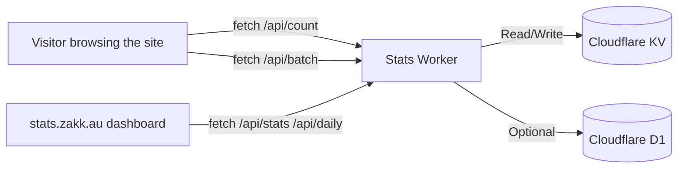


Cloudflare Stats Worker is the open analytics stack running on zakk.au: a single Worker delivers the API, dashboard, and Hugo Blowfish integration so page views and visitors refresh instantly without leaking user data. This guide combines the architecture, deployment steps, and optimisation tips so you can replicate the experience of `stats.zakk.au` from scratch.

## Why choose Cloudflare Stats Worker

- **Zero cookies, zero third-party trackers**: all data lives in Cloudflare KV (and optionally D1) under your account.
- **One Worker, full experience**: the Worker exposes `/api/*` endpoints and serves the dashboard UI in one deployment.
- **Locale-aware slug normalisation**: `/zh-tw/posts/foo/` and `/posts/foo/` map to a unified counter key.
- **Free to run**: the Worker, KV, and dashboard comfortably sit inside Cloudflare's free tier for personal sites.

### Pricing and free-tier allowances

**Cloudflare Workers Free**

- 100,000 requests per day with 10ms CPU time—enough headroom for PV / UV refreshes on typical blogs.
- Bursts are tolerated; add caching to weather social spikes without hitting limits.

**Cloudflare KV Free**

- 1 GB of storage suitable for multilingual slugs and daily aggregates.
- 100,000 read operations and 1,000 write/delete/list operations per day—most pages require just a single write.

**Workers Paid plan (USD $5/month)**

- 10,000,000 reads, 1,000,000 writes, 1,000,000 deletes, and 1,000,000 list operations bundled in.
- Includes 1 GB of KV storage (additional space billed at $0.50/GB).
- Ideal when the dashboard sees heavy traffic or you batch-ingest historical data.

**Cloudflare D1 (optional)**

- Free tier offers 5M queries and 1 GB of storage—enough for daily rollups.
- Upgrade to D1 paid if you expand into advanced reporting or long-term warehousing.

## Architecture and data flow



- The frontend script lives at `assets/js/cloudflare-stats.js` and discovers PV / Like placeholders on list and article pages.
- Worker-side storage uses keys such as `page:/posts/foo/:pv` and `:uv`, keeping every language in sync.
- The dashboard is a static bundle served by the same Worker—no extra hosting or bucket needed.

## Dashboard highlights

- **Today’s PV / UV cards**: glance at real-time growth as soon as the page loads.
- **Top articles ranking**: track which posts are trending across social channels.
- **Daily trend charts**: seven and thirty-day ranges with light/dark mode out of the box.
- **Full-screen mode**: friendly on phones and tablets thanks to responsive layout support.

Curious before deploying? Visit the [public stats page](/en/stats/) (or other locales) to explore the live dashboard.

## Prerequisites

- A Cloudflare account with billing enabled (the free quotas are sufficient for personal blogs).
- Your primary domain managed by Cloudflare, so you can map a subdomain route.
- Git, Node.js 18+, and the Wrangler CLI installed (`npm install -g wrangler`).
- macOS, Linux, or WSL2 recommended for running the helper scripts.

## Step 1: Clone the project

```bash
git clone https://github.com/Zakkaus/cloudflare-stats-worker.git
cd cloudflare-stats-worker
```

Repository layout overview:

- `src/`: Cloudflare Worker source code.
- `dashboard/`: static dashboard assets shipped with the Worker.
- `scripts/`: automation scripts referenced in this article.

## Step 2: Run the installation script

```bash
./scripts/install.sh
```

The script will:

1. Confirm Wrangler authentication.
2. Create the KV namespace and inject bindings into `wrangler.toml`.
3. Deploy the Worker and configure a route such as `stats.example.com`.
4. Perform a health check expecting `{"status":"ok"}`.

Need a different subdomain? Pass `--domain stats.yoursite.com`—see `./scripts/install.sh --help` for all flags.

## Step 3: Verify the API

First ensure the Worker is healthy:

```bash
curl https://stats.example.com/health
# {"status":"ok"}
```

Frequently used endpoints:

```bash
curl "https://stats.example.com/api/count?url=/" | jq
curl "https://stats.example.com/api/stats" | jq
curl "https://stats.example.com/api/daily" | jq
```

Or run the bundled verification script:

```bash
./scripts/verify.sh https://stats.example.com
```

It exercises every endpoint and prints pass/fail results in a single run.

## Step 4: Add the Hugo frontend script

Copy `cloudflare-stats-worker/client/cloudflare-stats.js` into your Hugo site—for example, `assets/js/cloudflare-stats.js`.

Then append the following snippet to `layouts/partials/extend-head.html`:

```go-html-template
{{ $stats := resources.Get "js/cloudflare-stats.js" | resources.Minify | resources.Fingerprint }}
<script defer src="{{ $stats.RelPermalink }}" data-api="https://stats.example.com"></script>
```

The script will:

- Detect elements like `span[id^="views_"]` and `span[id^="likes_"]`.
- Normalise URLs (for example, `/zh-tw/posts/foo/` → `/posts/foo/`).
- Call `/api/count` and `/api/batch`, updating the DOM as results arrive.
- Display `—` when requests fail, preventing layout glitches.

## Step 5: Override Blowfish templates

To ensure every locale maps to a single slug, add these overrides:

- `layouts/_default/list.html`
- `layouts/_default/single.html`
- `layouts/partials/meta/views.html`
- `layouts/partials/meta/likes.html`

Excerpt:

```go-html-template
{{ $oidPath := "" }}
{{ with .RelPermalink }}
  {{ $rel := printf "%s" . }}
  {{ if not (strings.HasSuffix $rel "/") }}
    {{ $rel = printf "%s/" $rel }}
  {{ end }}
  {{ $clean := strings.TrimLeft "/" $rel }}
  {{ if or (eq $clean "") (eq $clean "/") }}
    {{ $oidPath = "/" }}
  {{ else }}
    {{ $oidPath = $clean }}
  {{ end }}
{{ end }}
<span id="views_{{ $oidPath }}" class="animate-pulse text-sm text-muted">…</span>
```

The logic collapses `/zh-tw/posts/foo/`, `/posts/foo/`, and `/posts/foo/index.html` into the same metric key.

## Step 6: Test locally

```bash
hugo server -D
```

Open an article page and inspect your browser’s Network tab:

- `/api/count?url=/posts/foo/` should return 200.
- `/api/batch` should respond with the PV list for all placeholders.
- The console should be free of `count error` warnings.

For load testing, `hey` or `autocannon` against `/api/count` will reveal KV latency and headroom.

## Step 7: Build the stats dashboard page

This site now uses Hugo’s theme layout with a shortcode to embed the dashboard:

```markdown

```

- The shortcode at `layouts/shortcodes/statsDashboard.html` ships rounded corners, shadows, and dark mode-aware styling.
- Combined with `content/stats/index.*.md`, it produces `/stats/` while preserving Blowfish’s single-page layout.
- Want a bespoke UI? Fork the `dashboard/` bundle into a Hugo partial or a standalone SPA.

## FAQ

### Why not use Google Analytics?
Self-hosting keeps analytics cookie-free, accessible from regions with GA blocks, and fully customisable.

### Will the dashboard slow down the blog?
It loads inside an `<iframe>`, while article scripts defer execution and batch API calls, so the first contentful paint remains snappy.

### Can I extend the data model?
Yes—store JSON payloads in KV, add D1 tables, or forward events to external BI pipelines.

## Troubleshooting checklist

| Issue | What to check |
| ----- | -------------- |
| `/api/count` returns 500 | Inspect Wrangler logs: `npx wrangler tail --format=json` |
| PV / UV never update | Verify `data-api` / `data-site` attributes or clear Cloudflare cache |
| Need to exclude internal traffic | Add IP / UA blocks in `src/router.ts`, or integrate Turnstile |
| Dashboard renders blank | Check CORS headers, iframe URL, and CSP configuration |

## Next steps

- Snapshot KV data to R2 or GitHub for backups.
- Enable D1 to persist daily aggregates for long-term analytics.
- Use Cloudflare Queues or Scheduled Jobs for hourly compaction tasks.
- Add the dashboard to your main navigation (see this site’s menu configuration for reference).

---

This deployment guide powers the analytics on zakk.au—feel free to reach out via email or Matrix if you run into extra questions.
