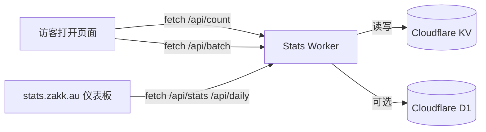


Cloudflare Stats Worker 是我在 zakk.au 部署的开源数据统计方案：一个 Worker 就能同时提供 API 与独立仪表板网站，让 PV / UV 实时刷新又不泄露访客隐私。本指南把架构、部署、调优一次讲透，照着步骤就能复刻 [stats.zakk.au](https://stats.zakk.au/) 的完整体验。

## 为什么选择 Cloudflare Stats Worker

- **零 Cookie、零第三方追踪**：数据全部留在你的 Cloudflare KV / D1 里，自行掌控保存策略。
- **一次部署、全套功能**：同一个 Worker 就提供 `/api/*` 接口和独立仪表板网站。
- **多语言 slug 统一**：`/zh-cn/posts/foo/` 与 `/posts/foo/` 会归并为同一个计数键。
- **免费额度够用**：对个人博客而言，Cloudflare 免费配额完全足够。
- **Hugo 整合简单**：客户端脚本与 partial 示例让文章页实时显示 PV/UV。

### 免费额度与升级选项

**Cloudflare Workers 免费方案**

- 每日 100,000 次请求与 10ms CPU 限额，足以应付 PV / UV 的实时刷新。
- 遇到访问高峰时可以搭配 Cache TTL，避免触发速率限制。

**Cloudflare KV 免费方案**

- 1 GB 存储空间，可轻松存放多语言页面与每日统计。
- 每日 100,000 次读取、1,000 次写入 / 删除 / 列表操作，大部分页面只需一次写入即可。

**Workers 付费方案（每月 5 美元）**

- 含 10,000,000 次读取、1,000,000 次写入、1,000,000 次删除、1,000,000 次列表操作。
- 预设附带 1 GB KV 存储，额外空间按 $0.50/GB 收费。
- 适合仪表板流量大或频繁批量写入的场景。

**Cloudflare D1（可选）**

- 免费层提供 5M 次查询与 1 GB 存储，足以保存每日汇总。
- 若需要长期报表或高级分析，可考虑升级到 D1 付费方案。

## 架构与数据流



- 前端脚本位于 `assets/js/cloudflare-stats.js`，会自动抓取列表页与文章页的 PV / Like 占位符。
- Worker 端以 `page:/posts/foo/:pv`、`:uv` 作为键值，确保不同语言共用同一份数据。
- 仪表板由同一个 Worker 提供静态页面，无需额外托管。

## 仪表板亮点

想先体验效果？直接访问 **[stats.zakk.au](https://stats.zakk.au/)** 看看实际运作！

- **今日 PV / UV 卡片**：一眼看到实时增长。
- **热门文章排行**：追踪哪些内容正在发酵。
- **每日趋势图**：预设显示 7 / 30 天，原生支持深浅色模式。
- **玻璃拟态设计**：清爽 UI，支持主题切换与中英文即时切换。
- **独立部署**：通过自定义域名（如 `stats.example.com`）直接访问，无需嵌入。

## 部署前准备

- 注册 Cloudflare 帐号并启用账单（免费额度即可覆盖）。
- 主域名托管在 Cloudflare，方便配置子域名路由。
- 已安装 Git、Node.js 18+、Wrangler CLI（`npm install -g wrangler`）。
- 推荐在 macOS、Linux 或 WSL2 环境执行脚本。

## 步骤 1：取得原始码

```bash
git clone https://github.com/Zakkaus/cloudflare-stats-worker.git
cd cloudflare-stats-worker
```

目录说明：

- `src/`：Cloudflare Worker 源码。
- `dashboard/`：随 Worker 部署的静态仪表板。
- `scripts/`：本文会用到的自动化脚本。

## 步骤 2：执行安装脚本

```bash
./scripts/install.sh
```

脚本会依序：

1. 检查 Wrangler 是否已登录。
2. 创建 KV 命名空间并写入 `wrangler.toml`。
3. 部署 Worker 并绑定子域名（例如 `stats.example.com`）。
4. 进行健康检查，预期返回 `{"status":"ok"}`。

若要使用不同子域，可加上 `--domain stats.yoursite.com`，完整参数请看 `./scripts/install.sh --help`。

## 步骤 3：验证 API

先确认健康检查通过：

```bash
curl https://stats.example.com/health
# {"status":"ok"}
```

常用端点：

```bash
curl "https://stats.example.com/api/count?url=/" | jq
curl "https://stats.example.com/api/stats" | jq
curl "https://stats.example.com/api/daily" | jq
```

也可以执行验证脚本：

```bash
./scripts/verify.sh https://stats.example.com
```

它会一次打完所有端点并输出通过 / 失败结果。

## 步骤 4：接入 Hugo 前端脚本

把 `cloudflare-stats-worker/client/cloudflare-stats.js` 复制到你的 Hugo 专案，例如 `assets/js/cloudflare-stats.js`。

接着在 `layouts/partials/extend-head.html` 加入：

```go-html-template
{{ $stats := resources.Get "js/cloudflare-stats.js" | resources.Minify | resources.Fingerprint }}
<script defer src="{{ $stats.RelPermalink }}" data-api="https://stats.example.com"></script>
```

脚本会：

- 寻找 `span[id^="views_"]`、`span[id^="likes_"]`。
- 正规化 URL（例如 `/zh-cn/posts/foo/` → `/posts/foo/`）。
- 调用 `/api/count`、`/api/batch` 并即时更新 DOM。
- 若请求失败则显示 `—`，避免版面错位。

## 步骤 5：覆写 Blowfish 模板

为了让所有语言共用同一 slug，需要新增下列覆写：

- `layouts/_default/list.html`
- `layouts/_default/single.html`
- `layouts/partials/meta/views.html`
- `layouts/partials/meta/likes.html`

示例片段：

```go-html-template
{{ $oidPath := "" }}
{{ with .RelPermalink }}
  {{ $rel := printf "%s" . }}
  {{ if not (strings.HasSuffix $rel "/") }}
    {{ $rel = printf "%s/" $rel }}
  {{ end }}
  {{ $clean := strings.TrimLeft "/" $rel }}
  {{ if or (eq $clean "") (eq $clean "/") }}
    {{ $oidPath = "/" }}
  {{ else }}
    {{ $oidPath = $clean }}
  {{ end }}
{{ end }}
<span id="views_{{ $oidPath }}" class="animate-pulse text-sm text-muted">…</span>
```

这样 `/zh-cn/posts/foo/`、`/posts/foo/`、`/posts/foo/index.html` 都会写入同一个键值。

## 步骤 6：本地测试

```bash
hugo server -D
```

在文章页的浏览器 Network 面板检查：

- `/api/count?url=/posts/foo/` 返回 200。
- `/api/batch` 覆盖所有占位符的 PV 数据。
- Console 不再出现 `count error` 警告。

若想压测，可用 `hey` 或 `autocannon` 打 `/api/count`，观察 KV 延迟表现。

## 步骤 7：访问仪表板

部署完成后，直接访问你的仪表板域名即可：

```
https://stats.example.com/
```

你会看到与 [stats.zakk.au](https://stats.zakk.au/) 相同的界面：

- 实时今日/全站 PV・UV 卡片
- API 健康状态指示灯
- 7/14/30 天趋势图表
- 热门页面 Top 10 排行
- 深浅色主题与中英文切换

**可选：嵌入博客页面**

如果你想把仪表板嵌入博客（如本站的 `/stats/` 页面），可使用 iframe 或项目提供的 Hugo 短码：

```markdown

```

短码位于 `layouts/shortcodes/statsDashboard.html`，可保持与 Blowfish 主题一致的样式。

## 常见问题

### 为什么不用 Google Analytics？
自托管方案可控、无 Cookie，在部分地区也不会被封锁，同时可以随需求扩充数据模型。

### 仪表板会拖慢页面吗？
仪表板通过 `<iframe>` 独立加载，文章脚本也使用 `defer` 与批量 API，首屏影响极小。

### 可以扩展数据模型吗？
当然，可以把 Worker 存储格式换成 JSON、增加 D1 数据表，或把数据投递到外部 BI。 

## 故障排查

| 现象 | 排查步骤 |
| ---- | -------- |
| `/api/count` 返回 500 | 使用 `npx wrangler tail --format=json` 查看日志 |
| PV / UV 不更新 | 检查前端 `data-api`、`data-site`，或清除 Cloudflare 缓存 |
| 想屏蔽内部流量 | 在 `src/router.ts` 增加 IP / UA 黑名单，或接入 Turnstile |
| 仪表板空白 | 确认 CORS 设置、iframe URL 与 CSP Header |

## 后续优化

- 定期把 KV 快照备份到 R2 或 GitHub。
- 启用 D1 将每日统计写入表格，方便长期分析。
- 利用 Cloudflare Queues / Scheduled Jobs 做每小时整理。
- 把仪表板加入主菜单（本文末尾有示例配置）。

---

这份部署指南即是 [stats.zakk.au](https://stats.zakk.au/) 的数据骨干—完成部署后，你将拥有：

✅ 独立仪表板网站（如 `stats.example.com`）  
✅ 完整的统计 API（`/api/count`、`/api/stats`、`/api/top` 等）  
✅ Hugo 文章页实时 PV/UV 显示  

如果在实作中遇到问题，欢迎在 [GitHub Issues](https://github.com/Zakkaus/cloudflare-stats-worker/issues) 联系我，我会持续更新脚本与文档。
