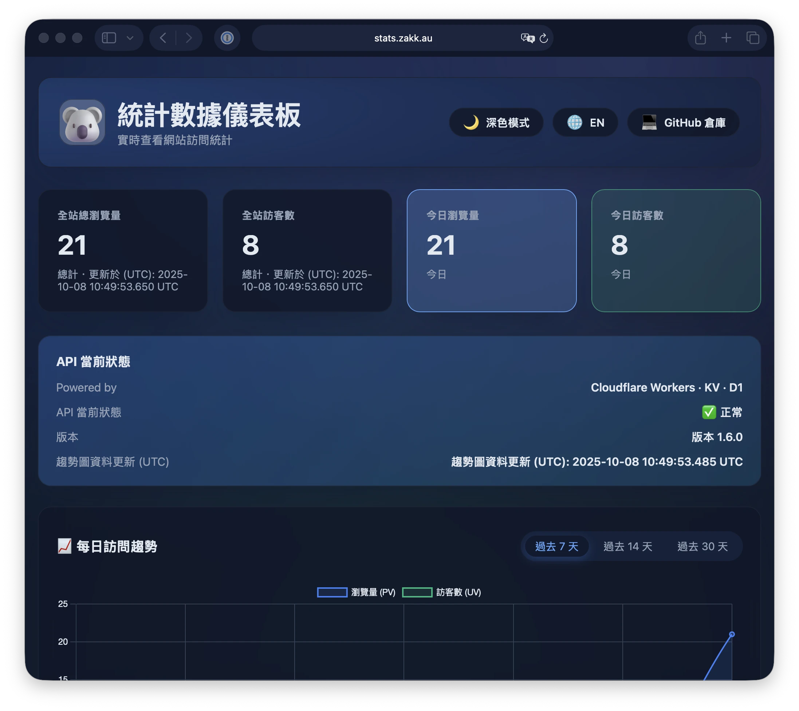

想要实时网站统计却不想用 Google Analytics?**Cloudflare Stats Worker** 是一个完全运行在 Cloudflare 边缘网络上的隐私优先分析方案。

看看实际案例：**[stats.zakk.au](https://stats.zakk.au/)**



## 为什么选择 Cloudflare Stats Worker?

- **隐私优先**：无 Cookie，IP 地址经 SHA-256 哈希并截断
- **零成本**：大多数个人网站使用 Cloudflare 免费方案即可运行
- **边缘性能**：基于 Cloudflare Workers + KV，全球低延迟访问
- **多语言支持**：自动规范化不同语言版本的路径
- **完整方案**：单一 Worker 同时提供 API 端点与独立仪表板

## 主要特色

### 实时分析
- 今日 PV/UV 实时计数器
- 7/14/30 天历史趋势
- 热门页面 Top 10 排行

### 精美仪表板
- 玻璃拟态设计，支持深浅色主题
- 响应式布局，支持手机与桌面
- 多语言界面（简中/英文）
- 可通过自定义域名访问（如 stats.example.com）

### 开发者友善 API
- RESTful API 端点，方便自定义集成
- 批次操作，高效数据查询
- 健康检查端点，便于监控

## 快速部署

> 需求：Node.js ≥ 18、`wrangler` CLI ≥ 3.0

1. **克隆并进入项目目录**
   ```bash
   git clone https://github.com/Zakkaus/cloudflare-stats-worker.git
   cd cloudflare-stats-worker
   ```

2. **安装 Wrangler 并登录**
   ```bash
   npm install -g wrangler
   wrangler login
   ```

3. **创建 KV 命名空间**
   ```bash
   wrangler kv namespace create PAGE_STATS
   wrangler kv namespace create PAGE_STATS --preview
   ```
   然后将 ID 粘贴到 `wrangler.toml` 中。

4. **（可选）启用 D1 以支持趋势图与热门页面**
   ```bash
   wrangler d1 create cloudflare-stats-top
   wrangler d1 execute cloudflare-stats-top --file=schema.sql --remote
   ```
   取消 `wrangler.toml` 中 `d1_databases` 区块的注释，并填入生成的 ID。

5. **部署 🎉**
   ```bash
   wrangler deploy
   ```

## 步骤 7：访问统计仪表板

部署完成后，直接访问你的仪表板域名：

```
https://stats.example.com/
```

你会看到与 [stats.zakk.au](https://stats.zakk.au/) 相同的精美分析界面：

- **实时指标**：今日 PV/UV 卡片实时更新
- **API 健康状态**：可视化系统状态指示器
- **趋势图表**：7/14/30 天交互式图表
- **热门页面**：最受欢迎内容排行榜
- **主题切换**：深浅色模式自由切换
- **语言选择器**：简中/英文界面选项

仪表板完全独立运作 - 无需嵌入，直接分享网址即可！

## 定价方案：免费 vs 付费

### Workers

| 方案 | 价格 | 包含请求数 | CPU 时间 | 超额计费 |
|------|------|-----------|---------|---------|
| **免费** | $0 | 每日 10 万次 | 10ms/次 | N/A（硬性上限） |
| **付费** | **$5/月** | 每月 1000 万次 | 50ms/次 | 每增加 100 万次 $0.50 |

### KV（键值存储）

| 方案 | 价格 | 读取 | 写入/删除/列表 | 存储空间 | 超额计费 |
|------|------|------|---------------|---------|---------|
| **免费** | $0 | 每日 10 万次 | 每日 1000 次 | 1 GB | N/A（硬性上限） |
| **付费** | **包含在 Workers Paid ($5/月)** | 每月 1000 万次 | 每月 100 万次 | 1 GB | • 读取：每 1000 万次 $0.50<br>• 写入：每 100 万次 $5<br>• 存储：每 GB/月 $0.50 |

### D1（无服务器 SQL 数据库）

| 方案 | 价格 | 读取列数 | 写入列数 | 存储空间 | 超额计费 |
|------|------|---------|---------|---------|---------|
| **免费** | $0 | 每日 500 万列 | 每日 10 万列 | 500 MB | N/A（硬性上限） |
| **付费** | **$5/月** | 每月 250 亿列 | 每月 5000 万列 | 5 GB | • 读取：每 100 万列 $0.001<br>• 写入：每 100 万列 $1<br>• 存储：每 GB/月 $0.75 |

### 按需计费选项

即使不订阅付费方案，也可以**启用按需计费**以避免硬性上限：
- Workers：超过免费额度后每 100 万次请求 $0.50
- KV：按上述单项操作计费
- D1：按上述单项操作计费

### 本项目建议方案

- **小型个人博客（< 1 万访客/日）**：免费方案完全足够 ✅
- **中型博客（1-5 万访客/日）**：建议 Workers Paid ($5/月)
- **高流量网站（> 5 万访客/日）**：Workers Paid + KV/D1 按需计费

> **注意**：D1 是可选的。如果你只需要实时 PV/UV 统计，单靠 KV 就足够，仪表板依然可用（仅缺少 Top 10 趋势图）。

## API 端点

部署后，你可以访问这些端点：

```bash
# 健康检查
curl https://stats.example.com/health

# 页面浏览计数
curl "https://stats.example.com/api/count?url=/posts/example/"

# 整体统计
curl https://stats.example.com/api/stats

# 每日趋势
curl https://stats.example.com/api/daily
```

## 架构

```
浏览器 → Worker (stats.example.com)
          ├── /api/*     → 统计 API
          ├── /*         → 仪表板静态文件
          └── Storage    → Cloudflare KV
```

## 常见问题

### 为什么不用 Google Analytics?
自架方案让你完全掌控数据，无需 Cookie，且不会被广告拦截器封锁。

### 可以自定义仪表板吗?
当然！仪表板源码在 dashboard/ 文件夹，可修改 HTML/CSS/JS 配合你的品牌风格。

### 如何备份数据?
使用项目提供的备份脚本，定期将 KV 数据导出到 R2 或 GitHub。

---

这就是 [stats.zakk.au](https://stats.zakk.au/) 背后的技术架构。部署完成后，你将拥有：

✅ 自定义域名的独立统计仪表板  
✅ 完整的统计 REST API  
✅ 无 Cookie 的隐私优先追踪  

如有问题，欢迎造访 [GitHub Issues](https://github.com/Zakkaus/cloudflare-stats-worker/issues)。
