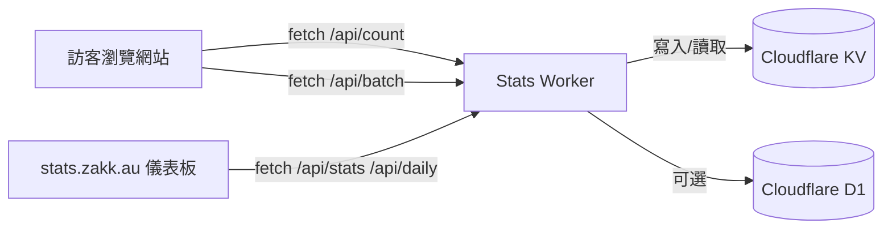


Cloudflare Stats Worker 是我在 zakk.au 使用的開源統計方案：同時提供 API、儀表板與 Hugo Blowfish 整合，讓 PV / UV 更新即時又不犧牲隱私。這篇文章把架構、部署與優化全部整理在一起，照著做就能打造出和 `stats.zakk.au` 一樣的體驗。

## 為什麼選擇 Cloudflare Stats Worker

- **零 Cookie、零追蹤腳本**：資料留在 Cloudflare KV / D1，自行掌控保存策略。
- **單一 Worker 搭配儀表板**：部署後即擁有 `/api/*` 端點與 dashboard UI。
- **多語系友善**：URL 正規化會把 `/zh-tw/posts/foo/`、`/posts/foo/` 視為同一頁。
- **成本為零**：免費額度對個人博客綽綽有餘，超量再視情況升級。

## 架構與資料流



- 前端腳本集中於 `assets/js/cloudflare-stats.js`，會自動抓出列表與文章頁的 PV / Like 佔位符。
- Worker 端以 `page:/posts/foo/:pv`、`:uv` 作為鍵值儲存，確保語系一致。
- 儀表板為同一個 Worker 提供的靜態頁面，不需要另架 Hosting。

## 儀表板亮點

- **今日 PV / UV 卡片**：進站即可掌握即時成長。
- **熱門文章排行榜**：追蹤哪些內容在社群發酵。
- **每日趨勢圖**：預設顯示 7/30 天，支援深色模式。
- **全螢幕檢視**：手機 / 平板使用者也能舒適觀看。

接下來進入部署流程，如果你想先看成果可以到 [統計監控頁面](/zh-tw/stats/) 試玩。

## 部署前準備

- 已註冊 Cloudflare 帳號並啟用帳單（免費額度足夠）。
- 你的主網域託管在 Cloudflare 上，方便設定子網域路由。
- 環境安裝 Git、Node.js 18+、Wrangler CLI（`npm install -g wrangler`）。
- 若要跑驗證腳本，建議 macOS / Linux，或 WSL2。

## 步驟 1：取得專案原始碼

```bash
git clone https://github.com/Zakkaus/cloudflare-stats-worker.git
cd cloudflare-stats-worker
```

專案主要目錄：

- `src/`：Cloudflare Worker 程式碼。
- `dashboard/`：儀表板靜態網頁，會隨 Worker 一起部署。
- `scripts/`：自動化腳本，本文都會使用。

## 步驟 2：執行安裝腳本

```bash
./scripts/install.sh
```

腳本會依序：

1. 檢查 Wrangler 是否登入。
2. 建立 KV Namespace 並寫入 `wrangler.toml`。
3. 上傳 Worker 並綁定 `stats.example.com` Route。
4. 啟動 Health Check 確認回傳 `{"status":"ok"}`。

過程中如果想使用不同子網域，可加上 `--domain stats.zakk.au` 這類參數，詳細請執行 `./scripts/install.sh --help` 查看。

## 步驟 3：驗證 API

先透過健康檢查確認 Worker 可用：

```bash
curl https://stats.example.com/health
# {"status":"ok"}
```

常用端點：

```bash
curl "https://stats.example.com/api/count?url=/" | jq
curl "https://stats.example.com/api/stats" | jq
curl "https://stats.example.com/api/daily" | jq
```

也可以使用專案提供的驗證腳本：

```bash
./scripts/verify.sh https://stats.example.com
```

這會一次測所有端點並顯示成功/失敗。

## 步驟 4：匯入 Hugo 前端腳本

在 Hugo 專案將 `cloudflare-stats-worker/client/cloudflare-stats.js` 複製到 `assets/js/cloudflare-stats.js`（或自訂路徑）。

接著於 `layouts/partials/extend-head.html` 加入：

```go-html-template
{{ $stats := resources.Get "js/cloudflare-stats.js" | resources.Minify | resources.Fingerprint }}
<script defer src="{{ $stats.RelPermalink }}" data-api="https://stats.example.com"></script>
```

這段腳本會：

- 尋找所有 `span[id^="views_"]`、`span[id^="likes_"]`。
- 對 URL 正規化，例如 `/zh-tw/posts/foo/` → `/posts/foo/`。
- 請求 `/api/count`、`/api/batch` 並更新 DOM。
- 失敗時顯示 `—`，避免破版。

## 步驟 5：覆寫 Blowfish 模板

為確保所有語系都使用一致 slug，我額外建立了四個覆寫檔案：

- `layouts/_default/list.html`
- `layouts/_default/single.html`
- `layouts/partials/meta/views.html`
- `layouts/partials/meta/likes.html`

範例片段：

```go-html-template
{{ $oidPath := "" }}
{{ with .RelPermalink }}
  {{ $rel := printf "%s" . }}
  {{ if not (strings.HasSuffix $rel "/") }}
    {{ $rel = printf "%s/" $rel }}
  {{ end }}
  {{ $clean := strings.TrimLeft "/" $rel }}
  {{ if or (eq $clean "") (eq $clean "/") }}
    {{ $oidPath = "/" }}
  {{ else }}
    {{ $oidPath = $clean }}
  {{ end }}
{{ end }}
<span id="views_{{ $oidPath }}" class="animate-pulse text-sm text-muted">…</span>
```

這樣就能把 `/zh-tw/posts/foo/`、`/posts/foo/`、`/posts/foo/index.html` 全部合併成單一鍵值。

## 步驟 6：本地測試

```bash
hugo server -D
```

在文章頁開啟瀏覽器 Network 面板，確認：

- `/api/count?url=/posts/foo/` 200；
- `/api/batch` 回傳所有卡片的 PV；
- Console 不再出現 `count error` 警告。

如果要壓測，可用 `hey` 或 `autocannon` 打 `/api/count`，觀察 R2/KV 的延遲。

## 步驟 7：建立統計儀表板頁面

本站改用 Hugo 內建模板搭配短碼嵌入儀表板：

```markdown

```

- 短碼位於 `layouts/shortcodes/statsDashboard.html`，自帶圓角、陰影與深色模式樣式。
- 搭配 `content/stats/index.*.md` 即可生成 `/stats/` 頁面，維持 Blowfish 的單篇排版。
- 想完全自訂 UI 時，可以把 `dashboard/` 資源改寫成 Hugo partial 或獨立的 SPA。

## 常見問答

### 為什麼不用 Google Analytics？
自架方案可控、無 Cookie，且能在中國訪問；同時可依需求調整資料模型。

### 儀表板會拖慢載入嗎？
儀表板獨立載入 `<iframe>`，文章頁腳本也以 `defer` 加上批次 API，對首屏影響極小。

### 可以擴充資料模型嗎？
可以，將 Worker 儲存格式改為 JSON 或新增 D1 資料表，就能把數據餵給外部 BI。

## 故障排查清單

| 狀況 | 排查步驟 |
| ---- | -------- |
| `/api/count` 回傳 500 | 檢查 Wrangler 日誌：`npx wrangler tail --format=json` |
| PV / UV 沒更新 | 確認前端 `data-api`、`data-site` 是否正確，或清除 Cloudflare Cache |
| 想排除內部流量 | 在 Worker `src/router.ts` 增加 IP / UA 黑名單，或加上 Turnstile 驗證 |
| 儀表板顯示空白 | 檢查 CORS 設定、iframe URL 與 CSP Header |

## 後續優化方向

- 把 KV Snapshot 自動備份到 R2 / GitHub。
- 啟用 D1 將每日統計寫入資料表，方便長期分析。
- 用 Cloudflare Queues/Scheduled Jobs 做每小時整理。
- 把儀表板加進主選單（本篇最後有範例）。

---

希望這份部署筆記能讓你也在自己的 Hugo 網站上跑起 Cloudflare Stats Worker。如果遇到其他問題，歡迎寫信或在 Matrix 聊天室討論！
