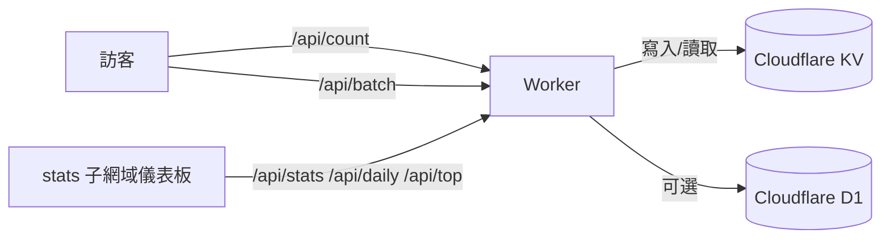


想要即時掌握 PV / UV 卻不想塞進 Google Analytics？Cloudflare Stats Worker 把 API、儀表板與 Hugo Blowfish 整合打包在同一個 Worker，只要幾分鐘就能擁有和 `stats.zakk.au` 一樣的統計頁面。本文整理我實際部署的流程、踩雷與維運做法，照著做就能快速上線。

## 為什麼選擇 Cloudflare Stats Worker

- **隱私優先**：無 Cookie、IP 以 SHA-256 雜湊後截斷，資料完全掌握在自己手中。
- **單一 Worker 全搞定**：部署一次即可同時拿到 `/api/*` 端點與儀表板頁面。
- **多語言友善**：`normalizePath()` 自動把 `/zh-tw/posts/foo/`、`/posts/foo/` 視為同一頁，不會發生語系分裂。
- **零元起跳**：Cloudflare 免費額度足以支撐個人部落格，爆紅時再考慮升級即可。
- **Hugo Blowfish 即插即用**：內建前端腳本與 partial 範例，免寫自訂 CSS。

## 免費額度與升級選項

| 項目 | 免費方案 | 升級建議 |
|------|----------|-----------|
| **Cloudflare Workers** | 每日 100,000 次請求、10ms CPU | 日流量破 10 萬或 CPU 受限時升級 Workers Paid（$5/月）。|
| **Cloudflare KV** | 1GB 儲存、每日 100k 讀取 / 1k 寫入 | 文章極多或想保留完整訪問紀錄時再升級，超額後依操作次數計費。|
| **Cloudflare D1** | 每月 5M 查詢、1GB 儲存 | 熱門排行、大量歷史日誌需求時升級 D1 Paid，否則免費層足夠。|

> 如果你只想要即時 PV/UV，D1 是選配。儀表板依然能顯示總覽資料，但沒有 Top 10 與趨勢圖。

## 架構與資料流



- Worker 端以 `page:/posts/foo/:pv`、`:uv` 命名儲存，語系或結尾 `/index` 皆會被正規化。
- 儀表板靜態檔案與 API 同站部署，省去額外 Hosting。
- `/api/top` 若偵測 D1 為空，會自動從 KV 回填，確保儀表板不中斷。

## 儀表板亮點

- 玻璃擬態設計、深淺色主題開關、繁中/英文立即切換。
- 今日 / 全站 PV・UV、API 健康狀態、更新時間（UTC）。
- 7 / 14 / 30 天趨勢圖，空資料時顯示零狀態不會爆錯。
- 熱門頁面 Top 10、搜尋任意路徑、快速跳文章頁。
- 可透過 iframe 或 Hugo 短碼嵌入既有頁面，維持體驗一致。

## 部署前準備

- Cloudflare 帳號與 `wrangler` CLI（`npm install -g wrangler`）。
- Node.js 18 以上版本、Git、macOS/Linux/WSL shell 環境。
- 若要綁定 `stats.example.com`，請先在 Cloudflare 啟用該網域代理。

---

## 步驟 1：取得專案原始碼

```bash
git clone https://github.com/Zakkaus/cloudflare-stats-worker.git
cd cloudflare-stats-worker
```

目錄導覽：

- `src/index.js`：Worker 路由、快取失效、D1 同步邏輯。
- `dashboard/`：儀表板 HTML/CSS/JS，部署時隨 Worker 一起上線。
- `scripts/`：部署、驗證、清理等自動化腳本。
- `schema.sql`：D1 的 `page_stats`、`site_daily_stats` 表定義。

## 步驟 2：執行安裝腳本

```bash
chmod +x scripts/deploy.sh
./scripts/deploy.sh --domain stats.example.com
```

腳本會：

1. 確認 Wrangler 已登入（必要時提醒 `wrangler login`）。
2. 建立 KV 命名空間並寫入 `wrangler.toml`。
3. 偵測 D1 ID 後自動套用 `schema.sql`（選配）。
4. 部署 Worker 並輸出儀表板 / API URL。

偏好手動部署？可依序執行：

```bash
wrangler kv namespace create PAGE_STATS
wrangler kv namespace create PAGE_STATS --preview
wrangler d1 create cloudflare-stats-top             # 若需 Top 10 / 趨勢圖
wrangler d1 execute cloudflare-stats-top --file=schema.sql --remote
wrangler deploy
```

## 步驟 3：驗證 API

```bash
curl https://stats.example.com/health
curl "https://stats.example.com/api/count?url=/" | jq
curl "https://stats.example.com/api/stats" | jq
curl "https://stats.example.com/api/top?limit=5" | jq
```

也可用專案提供的驗證腳本一次跑完：

```bash
./scripts/verify.sh https://stats.example.com
```

腳本會檢查所有端點與快取 header，確保部署完整。

## 步驟 4：匯入 Hugo 前端腳本

1. 將 `client/cloudflare-stats.js` 複製到你的 Hugo 專案，例如 `assets/js/cloudflare-stats.js`。
2. 在 `layouts/partials/extend-head.html` 加入：
   ```go-html-template
   {{ $stats := resources.Get "js/cloudflare-stats.js" | resources.Minify | resources.Fingerprint }}
   <script defer src="{{ $stats.RelPermalink }}"
           data-api="https://stats.example.com"
           data-site="https://zakk.au"></script>
   ```
3. 重新編譯 Hugo，檢查文章頁下方的 PV 佔位符是否載入動畫。

前端腳本會掃描 `span[id^="views_"]`、`likes_`，自動正規化路徑並呼叫 `/api/count` 或 `/api/batch` 更新數字。

## 步驟 5：覆寫 Blowfish 模板

為了讓多語系共用同一鍵值，我覆寫了下列檔案：

- `layouts/_default/list.html`
- `layouts/_default/single.html`
- `layouts/partials/meta/views.html`
- `layouts/partials/meta/likes.html`

核心邏輯是產出一致的 ID：

```go-html-template
{{- $slug := partial "stats/normalize-path" . -}}
<span id="views_{{ $slug }}" class="views-counter animate-pulse">—</span>
```

`partial "stats/normalize-path"` 會移除語言前綴、結尾 `index`，確保 `/zh-tw/posts/foo/` 與 `/posts/foo/` 寫到同一個鍵。

## 步驟 6：本地測試

```bash
wrangler dev
# 另開終端
hugo server -D
```

- 在瀏覽器的 Network 面板確認 `/api/count`、`/api/batch` 正常回傳。
- 想壓力測試可用 `npx autocannon` 擊打 `/api/count`，並透過 `wrangler tail` 觀察速率限制行為。

## 步驟 7：建立統計儀表板頁面

我在 Hugo 中建立一個 `/stats/` 專頁並嵌入短碼：

```markdown

```

- 短碼實作位於 `layouts/shortcodes/statsDashboard.html`，自帶深色模式與圓角樣式。
- 可在 `content/stats/index.zh-tw.md` 等檔案呼叫，維持 Blowfish 的文章排版。
- 若要全自訂 UI，可以把 `dashboard/` 改寫成 Hugo partial 或獨立 SPA。

---

## 常見問題

**為什麼不用 Google Analytics？**  
Cloudflare Stats Worker 自控可控、面向全球（包含中國）無問題，且不需要額外載入第三方腳本。

**儀表板會拖慢網頁嗎？**  
文章頁的統計腳本以 `defer` 載入並使用批次 API，對首屏影響極小；儀表板可另外以 iframe 嵌入，不影響主站載入。

**可以排除內部流量嗎？**  
可以，在 `src/index.js` 的 `enforceRateLimit` 或 `handleCount` 中加入 IP / User-Agent 判斷即可。

**如何清空所有統計？**  
先刪光 KV（`wrangler kv key list … | xargs wrangler kv key delete`），再執行 `DELETE FROM page_stats;`、`DELETE FROM site_daily_stats;`，最後確認 `/api/top` 返回空陣列。

---

上面這套流程就是我把 stats.zakk.au 搬上線的全部細節。若你也完成部署，歡迎在 Matrix 或社群分享成果；遇到問題也可以在 GitHub issues 找我，我會持續更新腳本與維運筆記。祝你玩得愉快！
