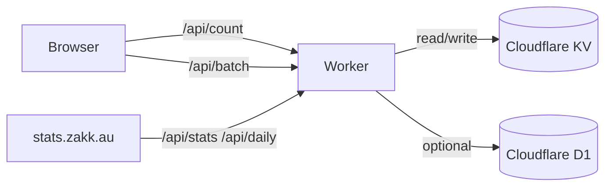

> The in-depth version of this story is currently available in Traditional Chinese: <a href="/zh-tw/posts/cloudflare-stats-worker-guide/">Cloudflare Stats Worker 統計系統概覽</a>. A full English translation is underway.

## Why Cloudflare Stats Worker

- Zero third-party cookies — every PV/UV lives inside Cloudflare KV or D1 that you control.
- One Worker, two jobs — it powers both the `/api/*` endpoints and the stats dashboard UI.
- Built-in URL normalisation keeps `/zh-tw/posts/foo/` and `/posts/foo/` aligned across locales.
- Generous free quota — perfect for personal blogs and side projects.

## Architecture at a Glance

- The helper in `assets/js/cloudflare-stats.js` scans for `views_/likes_` placeholders and batches API calls.
- The Worker stores keys like `page:/posts/foo/:pv` to unify traffic across languages and trailing slashes.
- The dashboard is shipped alongside the Worker so you don't need extra hosting.

## Explore the Dashboard

Visit the <a href="/en/stats/">embedded stats page</a> to see it live:

- Today’s PV/UV snapshot with delta indicators.
- Top articles over the last 7 days.
- Daily charts with light/dark themes out of the box.
- Full-screen mode for mobile dashboards.

## How We Integrate with Hugo Blowfish

- Overrides in `_default/list.html`, `_default/single.html`, and `partials/meta/views.html` / `likes.html` normalise slugs before they hit the API.
- The helper script is fingerprinted and loaded with `defer` via `extend-head.html`, keeping render performance snappy.
- Skeleton placeholders prevent layout shifts while data is loading.

## Need the Playbook?

Grab the full deployment tutorial here: <a href="/zh-tw/posts/cloudflare-stats-worker-deploy/">Cloudflare Stats Worker 部署與整合教學</a>. English and Simplified Chinese versions are on the roadmap.
