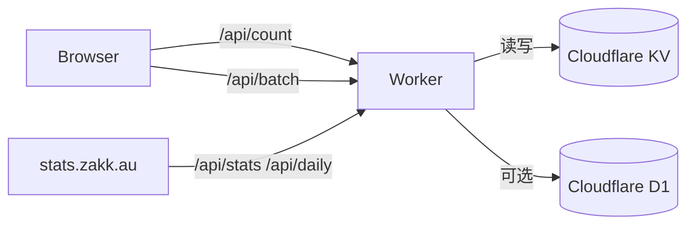

> 全文目前以繁体中文版为主：<a href="/zh-tw/posts/cloudflare-stats-worker-guide/">Cloudflare Stats Worker 統計系統概覽</a>。简体内容正在整理中。

## 为什么选择 Cloudflare Stats Worker

- **隐私友好**：不写 Cookie、不用第三方脚本，所有数据都在 Cloudflare KV / D1 内。
- **一键部署**：同一个 Worker 同时提供 `/api/*` 接口与仪表板前端。
- **多语系路径合并**：自动把 `/zh-cn/posts/foo/`、`/posts/foo/` 视为同一页面。
- **成本趋近 0**：免费额度足以覆盖个人博客流量。

## 架构示意

- 前端脚本 `assets/js/cloudflare-stats.js` 会批次请求并更新 `views_/likes_` 占位。
- Worker 以 `page:/posts/foo/:pv`、`:uv` 键值存储，多语言页面能共享统计。
- 仪表板随 Worker 打包，无需额外托管。

## 仪表板亮点

- 今日 PV / UV 卡片与成长率。
- 最近 7/30 天热门文章与趋势图。
- 支持深浅色模式、全屏观赏。

想直接体验，可看本站的 <a href="/zh-cn/stats/">统计监控页面</a>，就是以 `<iframe>` 嵌入正式环境的范例。

## Blowfish 主题整合

- 覆写 `_default/list.html`、`_default/single.html` 与 `partials/meta/views.html` / `likes.html`，统一 slug 格式。
- 在 `extend-head.html` 延迟加载并指纹化统计脚本，避免阻塞渲染。
- 设计骨架占位，确保数据加载前版面稳定。

## 想动手部署？

详细脚本、指令与排错都整理在：<a href="/zh-tw/posts/cloudflare-stats-worker-deploy/">Cloudflare Stats Worker 部署与整合教學</a>。稍后会补上简体与英文版。
