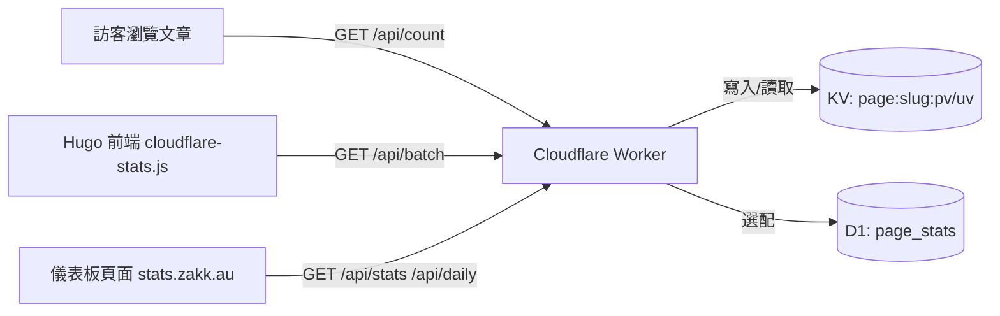


想要擁有即時、隱私友善又不用錢的流量統計？這篇文章帶你把 Cloudflare Stats Worker 部署到自己的網域，並在 Hugo Blowfish 主題上顯示與 `stats.zakk.au` 相同的儀表板。

## 為什麼選擇 Cloudflare Stats Worker

- **零第三方 Cookie**：利用 Workers + KV +（可選）D1，所有資料自己掌控。
- **極速佈署**：單一 Worker 同時提供 API 與儀表板，一鍵腳本 5 分鐘完成。
- **多語系友善**：內建路徑正規化，`/`、`/zh-tw/`、`/posts/foo/` 都會自動合併。
- **Hugo Blowfish 已整合**：本部落格的 `views_` / `likes_` 佔位符與 JS 腳本都經過優化。

## 整體架構一眼看懂



## 部署流程總覽

1. **Fork or Clone** [`cloudflare-stats-worker`](https://github.com/Zakkaus/cloudflare-stats-worker)。
2. **執行安裝腳本**：`./scripts/install.sh` 會自動建立 KV、上傳 Worker、設定自訂域名。
3. **確認健康檢查**：開啟 `https://stats.yourdomain.com/health` 應該看到 `{ "status": "ok" }`。
4. **驗證 API**：
   ```bash
   curl "https://stats.yourdomain.com/api/count?url=/" | jq
   curl "https://stats.yourdomain.com/api/stats" | jq
   ```
5. **啟用儀表板**：直接瀏覽 `https://stats.yourdomain.com/`，應會看到與 `stats.zakk.au` 相同的 UI。

> 💡 **小技巧**：`scripts/verify.sh https://stats.yourdomain.com` 可以一次測試 `count`、`stats`、`top`、`daily` 端點是否正常。

## Hugo Blowfish 整合步驟

### 1. 更新前端資源

本站把統計腳本放在 `assets/js/cloudflare-stats.js`。若你還沒引入，建議直接複製整份檔案，或使用 NPM 包：

```bash
npm install cloudflare-stats-worker-client
```

接著在 `layouts/partials/extend-head.html`（或任何 head 擴充）加入：

```go-html-template
{{ $stats := resources.Get "js/cloudflare-stats.js" | resources.Minify | resources.Fingerprint }}
<script defer src="{{ $stats.RelPermalink }}" data-api="https://stats.yourdomain.com"></script>
```

內建的 `cloudflare-stats.js` 會：

- 找出所有 `span[id^="views_"]`、`span[id^="likes_"]` 佔位符。
- 正規化路徑，例如 `/zh-tw/posts/foo/` → `/posts/foo/`。
- 自動呼叫 `/api/count`（當前頁）與 `/api/batch`（其他列表卡片）。
- 顯示「載入中」骨架，失敗時退回 `—`。

### 2. 調整模板 ID（若必要）

Blowfish 最新版已經用正規化邏輯輸出 `views_/likes_` ID。若你使用舊版，可參考以下片段加入 `_default/single.html` 與 `_default/list.html`：

```go-html-template
{{ $oidPath := "" }}
{{ with .RelPermalink }}
  {{ $rel := printf "%s" . }}
  {{ if not (strings.HasSuffix $rel "/") }}
    {{ $rel = printf "%s/" $rel }}
  {{ end }}
  {{ $clean := strings.TrimLeft "/" $rel }}
  {{ if or (eq $clean "") (eq $clean "/") }}
    {{ $oidPath = "/" }}
  {{ else }}
    {{ $oidPath = $clean }}
  {{ end }}
{{ end }}
...
<span id="views_{{ $oidPath }}" class="animate-pulse ...">loading</span>
```

> ✅ **本站做法**：新增三個覆寫檔案於 `layouts/_default/single.html`、`layouts/_default/list.html`、`layouts/partials/meta/{views,likes}.html`，避免直接修改子模組。

### 3. 驗證本機組建

```bash
hugo --gc --minify
npm run lint    # 若你有設定前端 lint
```

建議在瀏覽器開啟任意文章頁，打開 DevTools：

- Network→`api/count?url=/posts/foo/` 應為 200。
- Console 不應有 `[stats] count error` 警告。
- DOM 中 `span#views_posts/foo/` 內容會被換成千分位數字。

## 在本站內嵌儀表板

想直接在主題裡顯示儀表板？我們新增了一個 `stats` 頁面與 `stats-dashboard` 版面，透過 `<iframe>` 引用 `https://stats.zakk.au`：

- 頁面路徑：`/zh-tw/stats/`
- 版面檔：`layouts/stats/stats-dashboard.html`
- 支援全螢幕切換與深色模式（繼承儀表板內建功能）。

若你也想自訂版面，可以直接複製 `cloudflare-stats-worker/dashboard/index.html` 的 HTML + CSS + JS 到自己的 Hugo 資產，或是跟本站一樣以 `<iframe>` 方式嵌入已部署好的 Worker。

## 常見 FAQ

### Q1. 統計數字沒有同步？
- 先確認 Worker 的 `/health` 是否正常。
- 看看 KV 是否有 `page:/posts/foo/:pv`、`uv` 鍵值。
- 確保前端 `data-api` 屬性指向 HTTPS 主機。

### Q2. 想只顯示 PV、不遞增 UV？
請求 `/api/count` 時可以加 `action=pv` 或 `action=none` 參數；或改用 `/api/stats` 只讀資料。

### Q3. 想排除機器人流量？
- Worker 會依 `CF-Connecting-IP` + User Agent 做 UV 去重。
- 仍可依需求增加 UA 黑名單或導入 Turnstile 驗證。

### Q4. 可以把資料丟到外部 BI？
- KV 適合做即時顯示。
- 若要長期分析，建議開啟 D1，同步至 `page_stats` 表，再導出。

## 下一步

1. 將統計專案的 GitHub Workflow 設為每日備份 KV / D1。
2. 將儀表板加進主選單，方便快速查看今日 PV / UV。
3. 訂閱 Repository Release，掌握 Stats Worker 新功能（如 Top 10、Trend）。

如果你也完成了佈署，歡迎寫信或在 Matix 聊天室分享連結，讓更多人看到自架統計的威力！
